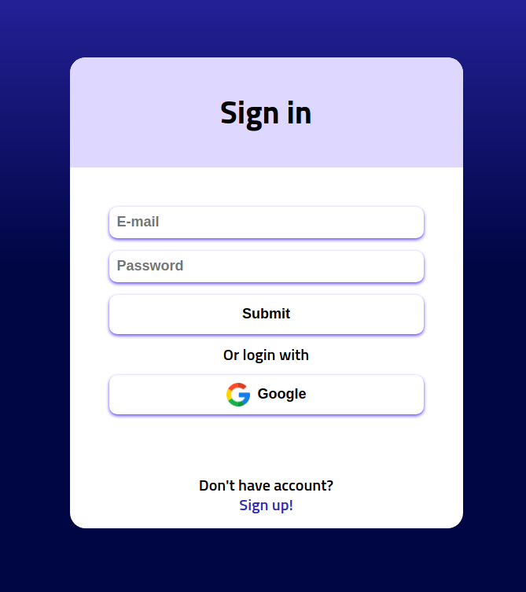

# CryptoCoins Project

Project available on: https://cryptocoins-823ba.web.app/

## Run project locally

To run project locally: npm run dev

## Database

All information for crypto coin is fetched from the following source: https://www.coingecko.com/pl/api

## Technologies

## Project description

The project is a website for tracking cryptocurrency prices, with basic information about various cryptocurrencies. Users can log in to the website and add cryptocurrencies to their portfolio. All transactions are saved and summarized on the user's profile page.

### Main site

### Market update

This page is a paginated list that shows the latest crypto rankings based on market capitalization.

### Coin details

After clicking on any coin, a modal will pop up. This modal shows more details about the chosen cryptocurrency.

### Transaction modal

The user can add any coin to their portfolio.

### Search

Users can search for any cryptocurrency available in the Coingecko database.

### User profile

On the profile page, users can track every transaction they have added.

### Sign in

Signing in is easy and fast. Users can create an account using their email or Google account.

